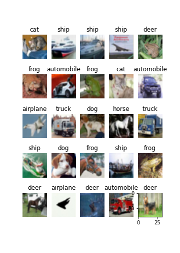

# Image_recognition_CIFAR10
Image recognition project

I used CIFAR10 Keras dataset to train Convolutional Neural networks to predict pictures as exersise for Keras tutorial.
Used local machine with training time 60 sec for one epoch, total 20 epochs.

Accuracy scores on test data 65%

